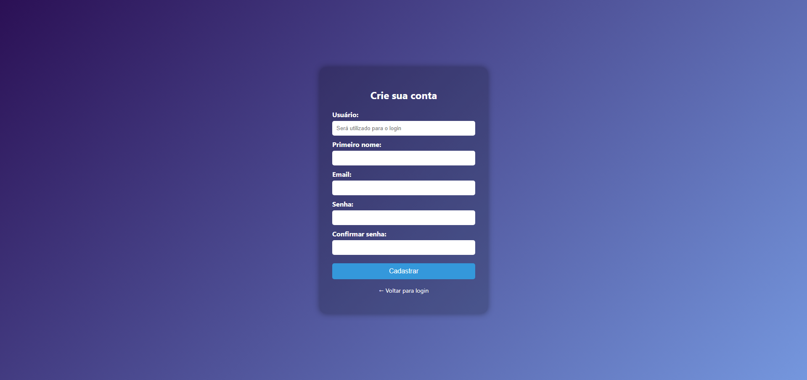
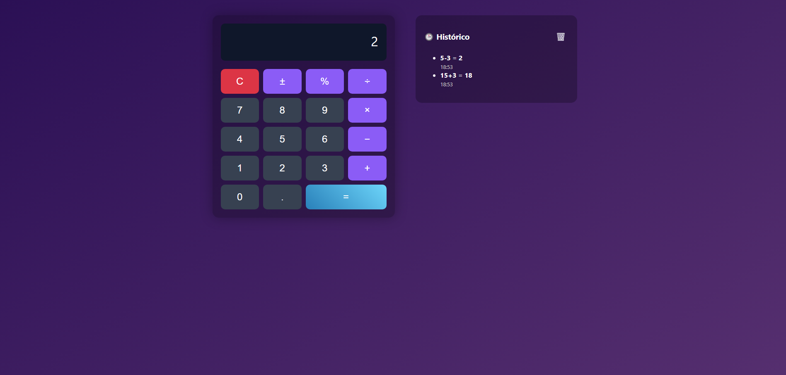

# 🧮 Calculadora com Django

Aplicação web desenvolvida como teste técnico, utilizando Django para backend e HTML/CSS/JS para uma interface moderna.

---

## 🚀 Funcionalidades

- Autenticação com login e cadastro de usuários
- Avaliação de expressões matemáticas com suporte a operadores básicos
- Histórico de operações por usuário
- Exibição do horário da operação
- Interface responsiva com design em tons de roxo e azul
- Botão para limpar o histórico de forma individual

---

## 💻 Tecnologias utilizadas

- Python
- Django
- SQLite (banco de dados local)
- HTML5 + CSS3 + JavaScript Vanilla

---

## 📸 Interface

### 🔐 Login

### 📝 Cadastro

### 🧮 Calculadora com histórico

---

## 👨‍💻 Autor

Desenvolvido por Bruno Difante de Moraes da Silva  
📧 difantemoraes@gmail.com  
🔗 [LinkedIn](https://www.linkedin.com/in/bruno-difante)  
💻 [GitHub](https://github.com/bruno-difante)
